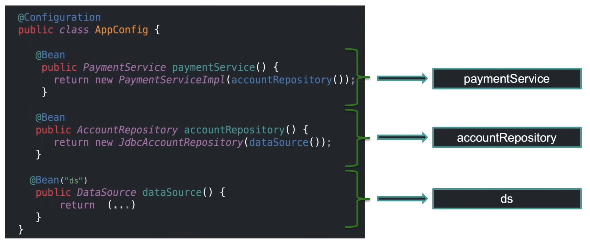

# Spring Boot

## What is Spring Framework?

- Spring Framework is an open-source framework for building enterprise Java applications
- Aims to simplify the complex enterprise Java application development.
- Core Features
  - IOC: Inversion on Control Container, manages lifecycle of defined Java object. Uses dependency injection to provide object reference during runtime.
  - AOP: Aspect Oriented Programming, provides more modularity that spans across application for logging, caching, transaction management, authentication, etc.
  - DAF: Data Access Framework, like JDBC, Hibernate, Java Persistence API (JPA)
  - MVC: Spring MVC Framework, popular MVC pattern, request-based framework. Dispatcher Servelet.

## What is a Spring Bean?

- An object that is managed by the Spring Framework in a Java application
- Aims to simplify the complex enterprise Java application development
- Spring Beans can be configured using XML, Java annotations or Java code.
- Lifecycle of a Spring Bean
  - Object lifecycle: The lifecycle of any object means when & how it is born, how it behaves throughout its life, and when & how it does
  - Bean lifecycle is managed by the spring container. The spring container creates the bean when container is first created, and inject dependencies.
- Configuring a Bean
  - `@Configuration` declares as "full" configuration class. Class must be "non-final" and "public"
  - `@Bean` declares bean configuration inside the configuration class. Method must be "non-final" and "non-private" (i.e., public, protect or package-private)

```java
@Configuration
public class AppConfig {
	@Bean
	public PaymentService paymentService(AccountRepository accountRepository) {
		return new PaymentServiceImpl(accountRepository);
	}

	@Bean
	public AccountRepository accountRepository() {
		return new JdbcAccountRepository(dataSource());
	}

	@Bean
	public DataSource dataSource() {
		return (...)
	}
}
```

## Spring Component Sample

- `@Component`: Spring Component contains class-level annotation that marks class as a Spring Component (`@Component`)
- `@Autowired`: Constructor-dependency injection is automatically done using `@Autowired` by injecting the constructor parameter(s)
- `@Autowired` on Constructor is optional if there is only 1 constructor.
- `@Autowired` simplifies dependency injection by allowing Spring to automatically resolve and inject dependencies from the Spring content. It relies on beans being registered, either via component scanning or `@Bean` methods. This automation helps manage dependencies efficiently and reduces boilerplate code.

```java
@Component
public class PaymentServiceImpl {
	private final AccountRepository accountRepository;

	@Autowired
	public PaymentServiceImpl(AccountRepository accountRepository) {
		this.accountRepository = accountRepository;
	}
}
```

## Spring Components

- Spring provides component stereotype to classify classes as Spring Components.
  - Sub-types are available as a refinement for the standard components.
- `@Component` as a general component annotation indicating that the class should be initialized, configured and managed by the core container.
- `@Repository`, `@Service` and `@Controller` as meta-annotation for `@Component` that allows to further refine components.
- Own stereotype annotations can (and should) be defined to support general architecture principles.

## Bean Naming



- To name a Bean, `@Bean('bean_name')`

## Dependency Injection Methods (Beans Injection)

1. Constructor Injection
2. Field Injection
3. Configuration Methods
4. Setter Methods Injection

---

### 1. Constructor Injection

```java
// Constructor Injection
@Service
public class DefaultPaymentService {
	private final AccountRepository accountRepository;

	public DefaultPaymentService(AccountRepository accountRepository) {
		this.accountRepository = accountRepository;
	}
}

@Repository
public class JdbcAccountRepository implements AccountRepository {
	private final DataSource dataSource;

	public JdbcAccountRepository(DataSource dataSource) {
		this.dataSource = dataSource;
	}
}
```

```java
// Using @Qualifier, tells spring which Beans to inject
@Configuration
public class ApplicationConfig {
	@Bean
	@Qualifier("primary")
	public AccountRepository primary() {
		return new JdbcAccountRepository(...);
	}

	@Bean
	@Qualifier("secondary")
	public AccountRepository secondary() {
		return new JdbcAccountRepository(...);
	}
}

// Injecting Bean into service layer
@Service
public class DefaultPaymentService {
	public DefaultPaymentService(@Qualifier("primary") AccountRepository accountRepository) {
		this.accountRepository = accountRepository;
	}
}
```

```java
// Using @Primary to define which bean should be prioritized for Spring to inject
@Configuration
public class ApplicationConfig {
	@Bean
	@Primary
	public AccountRepository primary() {
		return new JdbcAccountRepository(...);
	}

	@Bean
	public AccountRepository secondary() {
		return new JdbcAccountRepository(...);
	}
}

// Injecting Bean into service layer
@Service
public class DefaultPaymentService {

	@Autowired
	public DefaultPaymentService(AccountRepository accountRepository) {
		this.accountRepository = accountRepository;
	}
}
```

---

### 2. Field Injection

- Field Injection allows direct injection into field declaration without constructor or method delegation.
- **NOTE**: DISCOURAGES. Makes testing of components in isolation more complex, therefore should only be used in test classes.

```java
@Service
public class DefaultPaymentService {
	@Autowired
	private AccountRepository accountRepository
}
```

---

### 3. Method Injectino

- Allows setting one oe many dependencies by 1 method
- Allows for initialization work if needed while receiving dependencies.
- By annotating a method with `@Autowired`, Spring will know that this method needs to be injected with the appropriate beans from the Spring Context.

```java
@Service
public class DefaultPaymentService {
	@Autowired
	public void configureClass (
		AccountRepository accountRepository,
		FeeCalculator feeCalculator
	) {
		// ...
	}
}
```

### 4. Setter Injection

- Follows Java bean naming convention to inject dependency

```java
@Service
public class DefaultPaymentService {
	@Autowired
	public void setAccountRepository (
		AccountRepository accountRepository
	) {
		// ...
	}
}
```

- Constructor-based or setter-based Dependency Injection?
  - Use constructors for mandatory dependencies and setter methods or configuration methods for optional dependencies.
  - The Spring team generally advocates constructor injection.

---

## Bean Scoping

- What is "Bean Scope"?
  - Bean scope in Spring defines the lifecycle and visibility of a bean within the Spring container. It determines how long a bean should live and how it is created and shared within the application context.
- Spring provides multiple scopes
- "Singleton" is the default scope of a bean
- Bean Scoping
  - Singleton
  - Prototype
  - Request
  - Session
  - Application
  - WebSocket

```java
@Configuration
public class MyConfiguration {
	@Bean
	@Scope("prototype")
	public Bean1 bean1() {...}

	@Bean
	@SessionScope
	public Bean2 bean2() {...}
}
```

## Bean Environment

- Environment abstraction for beans to allow different sets of beans depending on environment like dev, prod, cloud, ...
- Environment can also be injected into code.

```java
@Configuration
public class ApplicationConfig {
	@Autowired final Environment environment;
	@Bean
	public PaymentService paymentService() {
		var profile = Profiles.of("cloud");
		var isOkay = this.environment.acceptsProfiles(profile);
		this.environment.getProperty("data.driver");
		return ...
	}
}
```

## Bean Profiles

- Bean that should only be active in certain environments.

```java
// Spring Component
@Service
@Profile("cloud")
public class DefaultPaymentService implements PaymentService{}

// Configuration Class
@Configuration
@Profile("cloud")
public class ApplicationConfig {}

// Bean Configuration method
@Configuration
public class ApplicationConfig {
	@Bean
	@Profile("cloud")
	public PaymentService paymentService() {}
}
```

- Profile Activation - Properties file

```yaml
## application.yaml
spring:
	profile:
		active: cloud
```

```sh
## application.properties
spring.profiles.active = cloud
```

## `@Value` Annotation

- Used at field level, method or constructor-parameter level. Used to injecting values into variables in a Class.

```java
// Assuming these values are stored in a file called `database.properties` under `resource` folder
@Configuration
@PropertySource("classpath:database.properties")
public class ApplicationConfig {
	@Value("${jdbc.url}")
	private String url;
	@Value("${jdbc.username}")
	private String username;
	@Value("${jdbc.password}")
	private String password;

	@Bean
	public DataSource dataSource() {
		return ...;
	}
}

// Can also inject specific bean from `system.properties`
@Component
public class FeeCalculator {
	private String defaultLocale;
	@Value("#{systemProperties['user.region']}")
	public void setDefaultLocale(String defaultLocale) {
		this.defaultLocale = defaultLocale;
	}
}
```

## Split Configuration

- Split configuration classes
- Import configuration

```java
@Configuration
public class ServiceConfig {
	@Bean
	public PaymentService paymentService() { return new ... }
}

@Configuration
public class RepositoryConfig {
	@Bean
	public AccountRepository accountRepository() { return new ... }
}

@Configuration
@Import({ServiceConfig.class, RepositoryConfig.class})
public class AppConfig {
	@Bean
	public DataSource dataSource() {...}
}
```

## Spring Initializr

- Go to [start.spring.io](https://start.spring.io/)
- Allows you to customize the project, version, language (Java, Kotlin or Groovy)
  - Packaging: `Jar` (recommended)
  - Java Version: 17
- `pom.xml`
