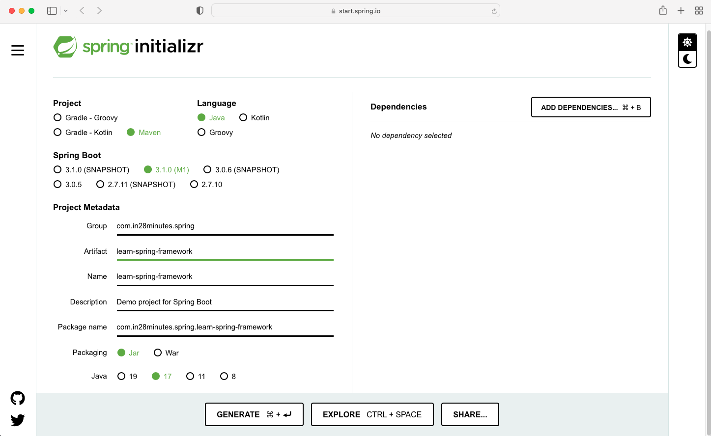

# Setup a Spring Project in IntelliJ

1. Go to [start.spring.io](https://start.spring.io)
2. Configure the project settings
   
3. To create a class on macOS, `Option + Enter`
4. To create interfaces, right-click folder --> New --> Java Class --> Interface